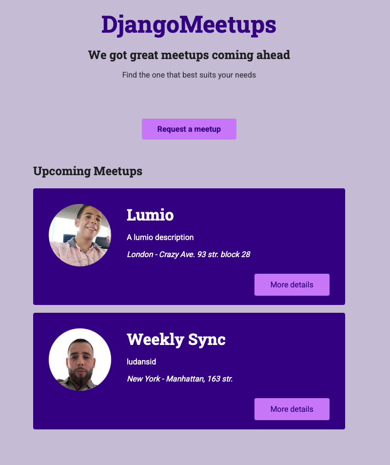
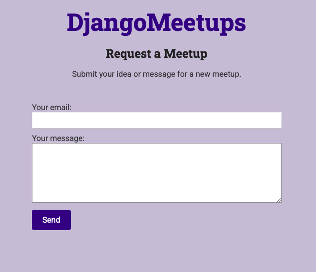

# README.md

# DjangoMeetups 🎉

Welcome to **DjangoMeetups**! 🚀 This is a simple yet powerful Django project designed to help users find, sign up for, and request their own meetups. It’s built with Django and uses an SQLite database for storage.

### Features:
- **Meetups Management**: Admins can create and manage meetups.
- **Signup**: Users can sign up for a meetup by providing their email address.
- **Request a Meetup**: Users can request a new meetup via a form; organizers receive an email notification.

## 🚀 Getting Started

All setup and run commands use Docker. Ensure you have Docker and Docker Compose installed.

1. **Clone the repository**
   ```bash
   git clone https://github.com/GospodinovPetar/python_strypes_projects.git
   cd djangoMeetups
   ```

2. **Build and start the containers**
   ```bash
   docker-compose up --build -d
   ```
   This command will:
   - Build the Docker image
   - Run database migrations
   - Start the web service on port 8000

3. **Access the application**
   Open your browser and go to:
   ```
   http://127.0.0.1:8000/
   ```

4. **Stopping the application**
   ```bash
   docker-compose down
   ```

---

## Docker Configuration

The project includes two files for containerization:

- **Dockerfile**: Builds the Python environment and installs dependencies.
- **docker-compose.yml**: Defines the `web` service, volume mounts, port mappings, and run commands.

## 📧 Request a Meetup

1. Navigate to **Request a Meetup** in the app.
2. Fill out the meetup details form.
3. Submit and check the organizer’s email for the notification.


---

## 📝 License

This project is licensed under the MIT License. Feel free to use, modify, and share it!

---

Happy coding with **DjangoMeetups**! 🎉
> _Created by Petar Gospodinov_  

